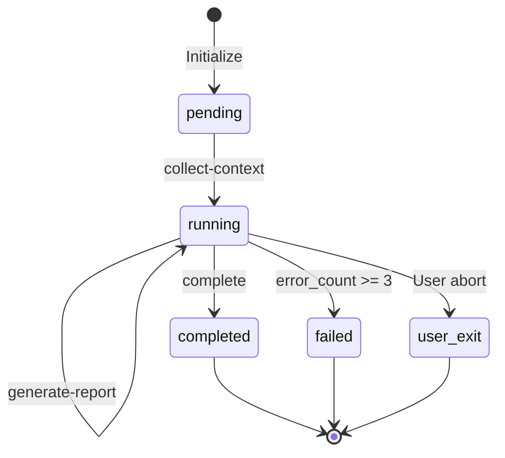

# State Schema

Code Review state structure definition.

## Schema Definition

```typescript
interface ReviewState {
  // === Metadata ===
  status: 'pending' | 'running' | 'completed' | 'failed' | 'user_exit';
  started_at: string;      // ISO timestamp
  updated_at: string;      // ISO timestamp
  completed_at?: string;   // ISO timestamp
  
  // === Review target ===
  context: {
    target_path: string;       // Target path, file or directory
    files: string[];           // List of files to review
    language: string;          // Primary programming language
    framework?: string;        // Framework, if any
    total_lines: number;       // Total lines of code
    file_count: number;        // Number of files
  };
  
  // === Scan results ===
  scan_completed: boolean;
  scan_summary: {
    risk_areas: RiskArea[];     // High-risk areas
    complexity_score: number;   // Complexity score
    quick_issues: QuickIssue[]; // Issues found during quick scan
  };
  
  // === Review progress ===
  reviewed_dimensions: string[]; // Completed review dimensions
  current_dimension?: string;    // Current review dimension
  
  // === Findings ===
  findings: {
    correctness: Finding[];
    readability: Finding[];
    performance: Finding[];
    security: Finding[];
    testing: Finding[];
    architecture: Finding[];
  };
  
  // === Report status ===
  report_generated: boolean;
  report_path?: string;
  
  // === Execution tracking ===
  current_action?: string;
  completed_actions: string[];
  errors: ExecutionError[];
  error_count: number;
  
  // === Statistics ===
  summary?: {
    total_issues: number;
    critical: number;
    high: number;
    medium: number;
    low: number;
    info: number;
    review_duration_ms: number;
  };
}

interface RiskArea {
  file: string;
  reason: string;
  priority: 'high' | 'medium' | 'low';
}

interface QuickIssue {
  type: string;
  file: string;
  line?: number;
  message: string;
}

interface Finding {
  id: string;                    // Unique identifier, e.g., "CORR-001"
  severity: 'critical' | 'high' | 'medium' | 'low' | 'info';
  dimension: string;             // Associated dimension
  category: string;              // Issue category
  file: string;                  // File path
  line?: number;                 // Line number
  column?: number;               // Column number
  code_snippet?: string;         // Problematic code snippet
  description: string;           // Issue description
  recommendation: string;        // Fix recommendation
  fix_example?: string;          // Example fix code
  references?: string[];         // Reference links
}

interface ExecutionError {
  action: string;
  message: string;
  timestamp: string;
}
```

## Initial State

```json
{
  "status": "pending",
  "started_at": "2024-01-01T00:00:00.000Z",
  "updated_at": "2024-01-01T00:00:00.000Z",
  "context": null,
  "scan_completed": false,
  "scan_summary": null,
  "reviewed_dimensions": [],
  "current_dimension": null,
  "findings": {
    "correctness": [],
    "readability": [],
    "performance": [],
    "security": [],
    "testing": [],
    "architecture": []
  },
  "report_generated": false,
  "report_path": null,
  "current_action": null,
  "completed_actions": [],
  "errors": [],
  "error_count": 0,
  "summary": null
}
```

## State Transitions



## Dimension Review Order

1. **correctness** - Correctness, highest priority
2. **security** - Security, critical
3. **performance** - Performance
4. **readability** - Readability
5. **testing** - Test coverage
6. **architecture** - Architectural consistency

## Finding ID Format

```text
{DIMENSION_PREFIX}-{SEQUENCE}

Prefixes:
- CORR: Correctness
- READ: Readability
- PERF: Performance
- SEC:  Security
- TEST: Testing
- ARCH: Architecture

Example: SEC-003 = Security issue #3
```
